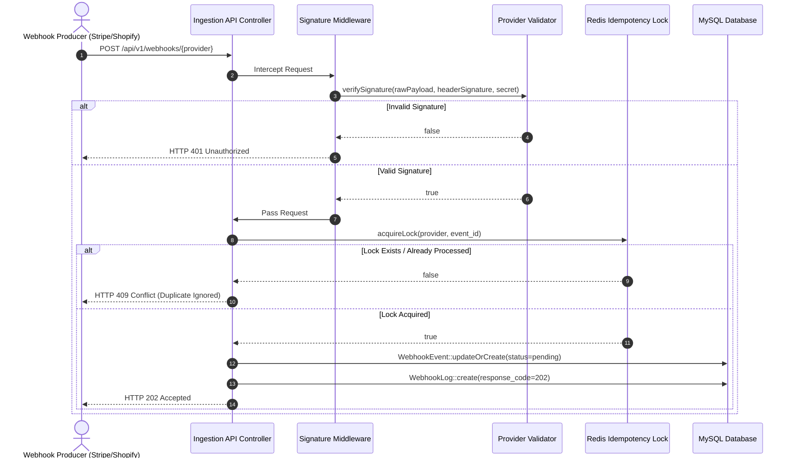
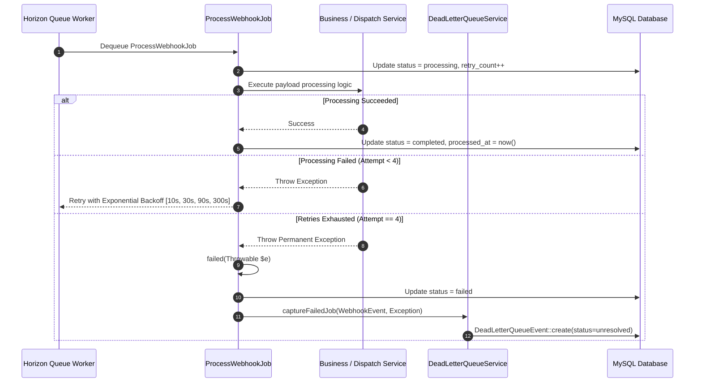
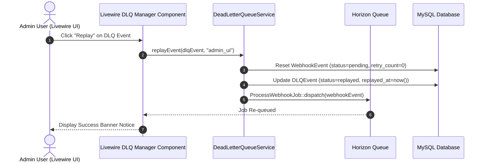

# Webhook Lifecycle Sequence Flowcharts

This document details the sequence flowcharts and architectural interactions across the entire **Laravel Webhook Engine** lifecycle.

---

## 1. Webhook Ingestion & HMAC Signature Verification

---

## 2. Horizon Queue Processing & Exponential Retries

---

## 3. Dead-Letter Queue (DLQ) Alerting & Manual Replay

